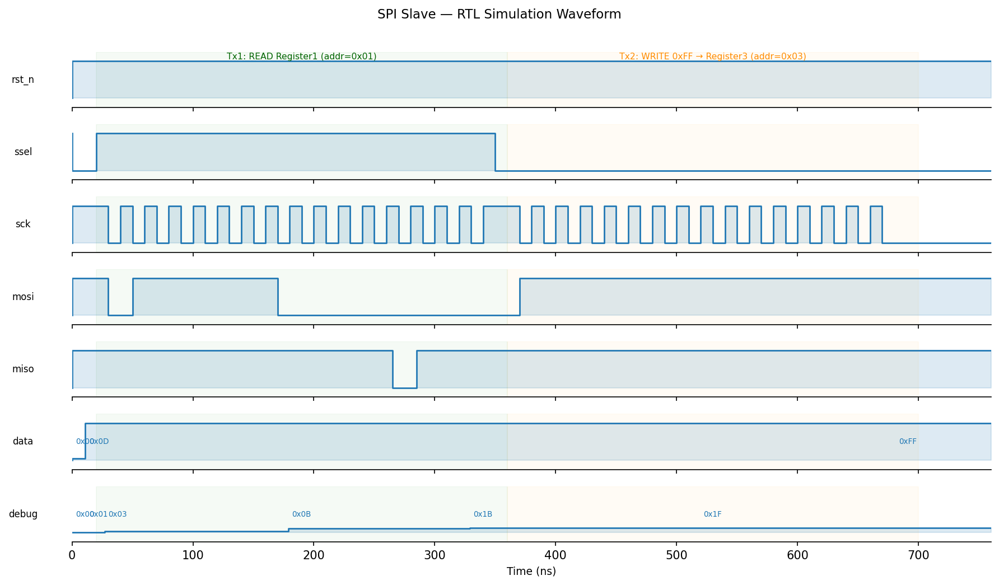
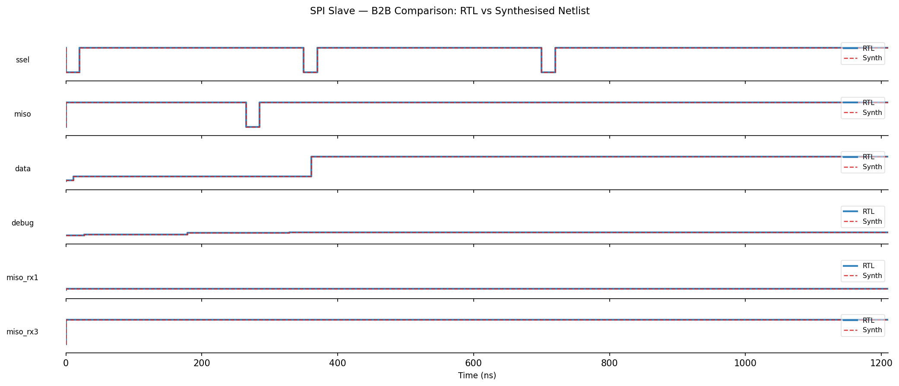

# spi_slave — SPI Slave IP for IHP SG13G2

A small, synchronous SPI slave IP block implemented in Verilog and converted 
to GDSII for the IHP SG13G2 0.13 µm BiCMOS process using the open-source
LibreLane/OpenROAD RTL-to-GDS flow.

**Author:** Koen Van Caekenberghe, ChipDesign B.V.  
**License:** Apache 2.0  
**PDK:** IHP SG13G2  
**Die area:** 157.78 µm × 176.50 µm  

---

## Design overview

The `spi_slave` module exposes eight 8-bit registers over SPI (Mode 0,
CPOL=0, CPHA=0) and provides a secondary parallel read port for on-chip
register readback independent of the SPI bus.

| Feature | Value |
|---|---|
| Protocol | SPI Mode 0 (CPOL=0, CPHA=0) |
| Register count | 8 × 8-bit |
| Address bits | 7 (lower bits of command byte) |
| R/nW flag | Bit 7 of command byte: 1=Read, 0=Write |
| Parallel read port | `Add2_in[7:0]` / `Data2_out[7:0]` |
| Debug port | `debug[7:0]` — sticky OR of FSM states visited |
| Reset | Active-low asynchronous (`iRST_N`) |

The SPI interface is a 5-state Moore FSM (IDLE → COMMAND → READ/WRITE → END).
All asynchronous SPI inputs pass through a two-flip-flop metastability
synchroniser before entering the system-clock domain.

---

## Repository layout

```
spi_slave.v                  RTL source
spi_slave.gds                Final GDS (IHP SG13G2, with seal ring)
spi_slave.def                Final DEF
tb_spi_slave.v               RTL testbench (three SPI transactions: read, write, read-back)
tb_spi_slave_compare.v       B2B testbench (RTL vs synthesised netlist)
gen_waveforms.py             VCD parser and waveform PNG generator
waveform_rtl.png             RTL simulation waveform
waveform_b2b.png             B2B overlay waveform (RTL vs netlist)
verification_report.pdf      Compiled verification report (LaTeX)
verification_report.tex      LaTeX source for the report
flow/
  config.yaml                LibreLane flow configuration
  constraint.sdc             Timing constraints (10 ns system clock)
  run_flow.sh                Flow entry point
  ihp_pdk.env.example        PDK environment template
  Makefile                   LibreLane/OpenROAD make targets
  spi_slave_synth.v          Yosys-generated structural netlist
  spi_slave_synth.json       Synthesis statistics
  synth.ys                   Yosys synthesis script (standalone)
  place_route.tcl            OpenROAD fallback placement script
```

---

## RTL simulation

Requires [Icarus Verilog](https://steveicarus.github.io/iverilog/) ≥ 11.

### RTL testbench

```bash
iverilog -g2012 -o tb_rtl.out tb_spi_slave.v
vvp tb_rtl.out                    # produces tb_spi_slave.vcd
```

Expected output:

```
PASS 1100: miso_rx1=0x0B data=0xFF miso_rx3=0xFF debug=0x1F
```

### Back-to-back (RTL vs synthesised netlist)

```bash
# RTL
iverilog -g2012 -o tb_cmp_rtl.out tb_spi_slave_compare.v
vvp tb_cmp_rtl.out                # produces tb_spi_slave_compare.vcd

# Synthesised netlist (Yosys generic cells, no PDK library needed)
iverilog -g2012 -DSYNTH -o tb_cmp_syn.out flow/spi_slave_synth.v tb_spi_slave_compare.v
vvp tb_cmp_syn.out                # produces tb_spi_slave_synth.vcd
```

Both should print:

```
FINISH 1100: miso_rx1=0x0B data=0xFF miso_rx3=0xFF debug=0x1F
PASS: all checks passed
```

### Generate waveform images

```bash
pip install matplotlib numpy          # one-time
python3 gen_waveforms.py              # reads *.vcd, writes waveform_*.png
```

---

## RTL-to-GDS flow

Requires [IIC-OSIC-TOOLS](https://github.com/iic-jku/IIC-OSIC-TOOLS) or a
compatible environment with LibreLane, OpenROAD, and the IHP SG13G2 PDK.

```bash
cd flow
cp ihp_pdk.env.example ihp_pdk.env
# Edit ihp_pdk.env — set PDK_ROOT and PATH to match your installation
./run_flow.sh
```

The flow runs 69 LibreLane/OpenROAD steps (synthesis → floorplan → placement
→ CTS → global routing → detailed routing → RCX → STA → GDS stream-out →
seal-ring insertion).  Final outputs land in
`flow/runs/<RUN_DATE>/final/`.

### Tested environment

Verified inside the **IIC-OSIC-TOOLS** Docker/WSL2 container
(image tag `2025.12` or later):

| Tool | Version |
|---|---|
| LibreLane | 1.x |
| OpenROAD | 2.x |
| Yosys | ≥ 0.40 |
| KLayout | 0.30.x |
| IHP PDK | ihp-sg13g2 (open release) |

> **Note:** A bug in the librelane `ihp_seal_ring.py` script (use of the
> deprecated `create_cell` KLayout API and missing nm→µm unit conversion)
> must be patched manually in the installed librelane package — see
> `flow/README.md` for the exact patch.

### Flow results

| Metric | Value |
|---|---|
| Die size | 157.78 µm × 176.50 µm |
| Final GDS | `spi_slave.gds` (803 KiB, seal ring included) |
| Final DEF | `spi_slave.def` (624 KiB) |
| Antenna check | Pass |
| LVS | Pass |
| DRC | Skipped (KLayout and Magic DRC disabled in config) |
| Timing | No setup/hold violations reported |

---

## Verification results

All output signals are bit-for-bit identical between RTL and synthesised netlist:

| Signal | RTL | Synth | |
|---|---|---|---|
| `rst_n` | 1 | 1 | ✓ |
| `ssel` | 1 | 1 | ✓ |
| `sck` | 0 | 0 | ✓ |
| `mosi` | 1 | 1 | ✓ |
| `miso` | 1 | 1 | ✓ |
| `data` | 0xFF | 0xFF | ✓ |
| `debug` | 0x1F | 0x1F | ✓ |
| `miso_rx1` | 0x0B | 0x0B | ✓ |
| `miso_rx3` | 0xFF | 0xFF | ✓ |

`miso_rx1=0x0B` is Register 1's reset value read via SPI in Tx1.
`miso_rx3=0xFF` is the write-confirmation: Tx3 read back the 0xFF written by Tx2.
`debug=0x1F` confirms all five FSM states (IDLE, COMMAND, WRITE, READ, END) were visited.





See `verification_report.pdf` for full analysis.

---

## License

Copyright 2026 Koen Van Caekenberghe, ChipDesign B.V.

Licensed under the [Apache License, Version 2.0](LICENSE).
