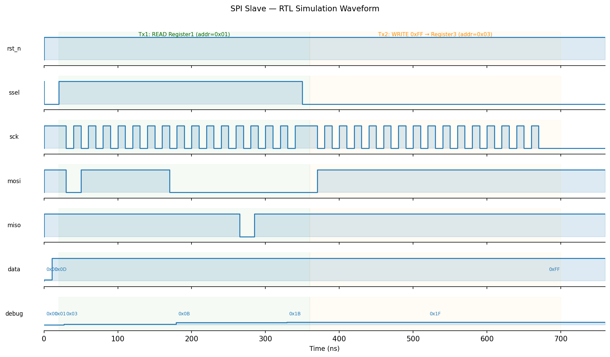
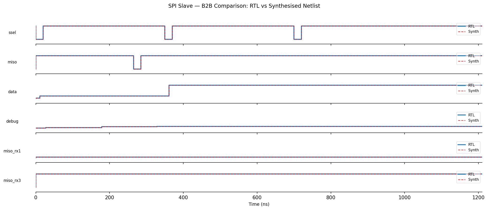

# spi_slave — SPI Slave IP for IHP SG13G2

A small, synchronous SPI slave IP block implemented in Verilog and converted
to GDSII for the IHP SG13G2 0.13 µm BiCMOS process using the open-source
LibreLane/OpenROAD RTL-to-GDS flow.

**Author:** Koen Van Caekenberghe, ChipDesign B.V.
**License:** Apache 2.0
**PDK:** IHP SG13G2

The repository contains two variants:

| Variant | Location | SPI modes | Verified against |
|---|---|---|---|
| **Mode 0** (original) | repository root | 0 (CPOL=0, CPHA=0) | generic SPI master model |
| **All-modes** | [`allmodes/`](allmodes/) | 0–3, selected by `CPOL`/`CPHA` pins | Raspberry Pi (spidev) and Infineon AURIX (QSPI) master models |

Both variants share the register map and FSM; the all-modes variant adds two
mode-select input pins and generalises the SCK edge handling. See
[`allmodes/README.md`](allmodes/README.md) for its full documentation, and
[`verification_report.pdf`](verification_report.pdf) for the combined
verification and signoff report covering both variants.

---

## Design overview (mode-0 variant)

The `spi_slave` module exposes eight 8-bit registers over SPI (Mode 0,
CPOL=0, CPHA=0) and provides a secondary parallel read port for on-chip
register readback independent of the SPI bus.

| Feature | Value |
|---|---|
| Protocol | SPI Mode 0 (CPOL=0, CPHA=0) |
| Register count | 8 × 8-bit |
| Address bits | 7 (lower bits of command byte) |
| R/nW flag | Bit 7 of command byte: 1=Read, 0=Write |
| Parallel read port | `Add2_in[7:0]` / `Data2_out[7:0]` |
| Debug port | `debug[7:0]` — sticky OR of FSM states visited |
| Reset | Active-low asynchronous (`iRST_N`) |

The SPI interface is a 5-state Moore FSM (IDLE → COMMAND → READ/WRITE → END).
All asynchronous SPI inputs pass through a two-flip-flop metastability
synchroniser before entering the system-clock domain.

---

## Repository layout

```
spi_slave.v                  RTL source (mode-0 variant)
spi_slave.gds                Final GDS (IHP SG13G2 core macro, DRC/LVS clean — see signoff note)
spi_slave.def                Final DEF
tb_spi_slave.v               RTL testbench (three SPI transactions: read, write, read-back)
tb_spi_slave_compare.v       B2B testbench (RTL vs synthesised netlist)
gen_waveforms.py             VCD parser and waveform PNG generator
waveform_rtl.png             RTL simulation waveform
waveform_b2b.png             B2B overlay waveform (RTL vs netlist)
verification_report.pdf      Combined verification & signoff report (both variants)
report/                      Report source (Markdown, ChipDesign pandoc template)
flow/                        LibreLane flow configuration (see flow/README.md)
allmodes/                    All-modes variant: RTL, host testbenches, flow, GDS
```

---

## RTL simulation (mode-0 variant)

Requires [Icarus Verilog](https://steveicarus.github.io/iverilog/) ≥ 11.

### RTL testbench

```bash
iverilog -g2012 -o tb_rtl.out tb_spi_slave.v
vvp tb_rtl.out                    # produces tb_spi_slave.vcd
```

Expected output:

```
PASS 1100: miso_rx1=0x0B data=0xFF miso_rx3=0xFF debug=0x1F
```

### Back-to-back (RTL vs synthesised netlist)

```bash
# RTL
iverilog -g2012 -o tb_cmp_rtl.out tb_spi_slave_compare.v
vvp tb_cmp_rtl.out                # produces tb_spi_slave_compare.vcd

# Synthesised netlist (Yosys generic cells, no PDK library needed)
iverilog -g2012 -DSYNTH -o tb_cmp_syn.out flow/spi_slave_synth.v tb_spi_slave_compare.v
vvp tb_cmp_syn.out                # produces tb_spi_slave_synth.vcd
```

Both should print:

```
FINISH 1100: miso_rx1=0x0B data=0xFF miso_rx3=0xFF debug=0x1F
PASS: all checks passed
```

### Generate waveform images

```bash
pip install matplotlib numpy          # one-time
python3 gen_waveforms.py              # reads *.vcd, writes waveform_*.png
```

---

## RTL-to-GDS flow

Requires [IIC-OSIC-TOOLS](https://github.com/iic-jku/IIC-OSIC-TOOLS) or a
compatible environment with LibreLane, OpenROAD, and the IHP SG13G2 PDK.

```bash
cd flow
cp ihp_pdk.env.example ihp_pdk.env
# Edit ihp_pdk.env — set PDK_ROOT and PATH to match your installation
./run_flow.sh
```

The flow runs the LibreLane Classic flow (70 steps with LibreLane v3:
synthesis → floorplan → placement → CTS → routing → RCX → STA → GDS
stream-out). Final outputs land in `flow/runs/<RUN_DATE>/final/`. See
`flow/README.md` for LibreLane-version notes.

### Flow results (LibreLane v3.1.0, run RUN_2026-08-08_22-27-58)

| Metric | Value |
|---|---|
| Die size | 157.78 µm × 176.50 µm |
| Setup / hold WNS, TNS | 0 / 0 at all corners (ss 1.08 V 125 °C, tt 1.20 V 25 °C, ff 1.32 V −40 °C) |
| Routing DRC | 0 errors |
| Antenna check | 0 violations |
| LVS (Netgen) | Pass — circuits match uniquely (597 devices / 608 nets) |
| Signoff DRC (IHP KLayout deck) | Clean apart from 8 chip-level density/filler markers (foundry fill resolves at tapeout) |

> **Signoff note:** `spi_slave.gds` is the **core macro without seal ring**.
> The seal ring previously included in this file (inserted by the LibreLane
> `KLayout.SealRing` step) was found to be defective — it overlapped the
> routed core and carried a full-die `EdgeSeal` marker, failing the IHP
> signoff DRC deck with >21k violations. A seal ring must be added correctly
> at chip assembly. Full analysis in `verification_report.pdf`.

---

## Verification results (mode-0 variant)

All output signals are bit-for-bit identical between RTL and synthesised netlist:

| Signal | RTL | Synth | |
|---|---|---|---|
| `rst_n` | 1 | 1 | ✓ |
| `ssel` | 1 | 1 | ✓ |
| `sck` | 0 | 0 | ✓ |
| `mosi` | 1 | 1 | ✓ |
| `miso` | 1 | 1 | ✓ |
| `data` | 0xFF | 0xFF | ✓ |
| `debug` | 0x1F | 0x1F | ✓ |
| `miso_rx1` | 0x0B | 0x0B | ✓ |
| `miso_rx3` | 0xFF | 0xFF | ✓ |

`miso_rx1=0x0B` is Register 1's reset value read via SPI in Tx1.
`miso_rx3=0xFF` is the write-confirmation: Tx3 read back the 0xFF written by Tx2.
`debug=0x1F` confirms all five FSM states (IDLE, COMMAND, WRITE, READ, END) were visited.





The all-modes variant is additionally verified in all four SPI modes against
Raspberry Pi and AURIX QSPI master models, on RTL and synthesised netlist —
see [`allmodes/README.md`](allmodes/README.md).

See `verification_report.pdf` for the full combined analysis, including the
standalone signoff DRC/LVS investigation.

---

## License

Copyright 2026 Koen Van Caekenberghe, ChipDesign B.V.

Licensed under the [Apache License, Version 2.0](LICENSE).
