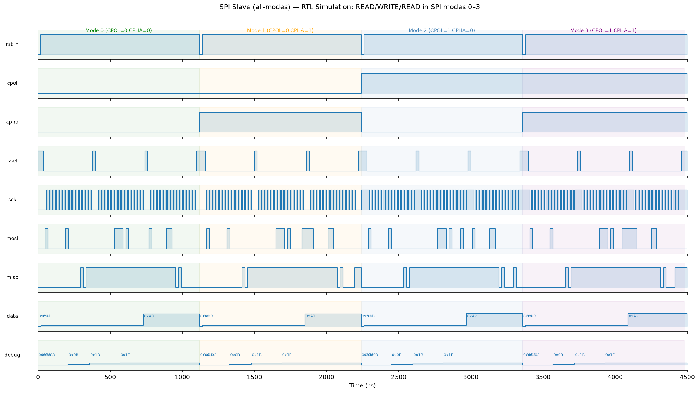
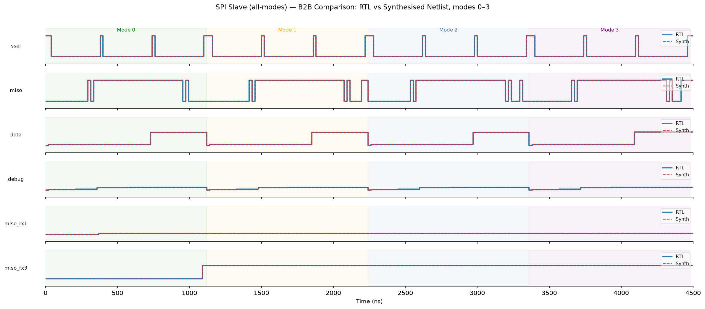
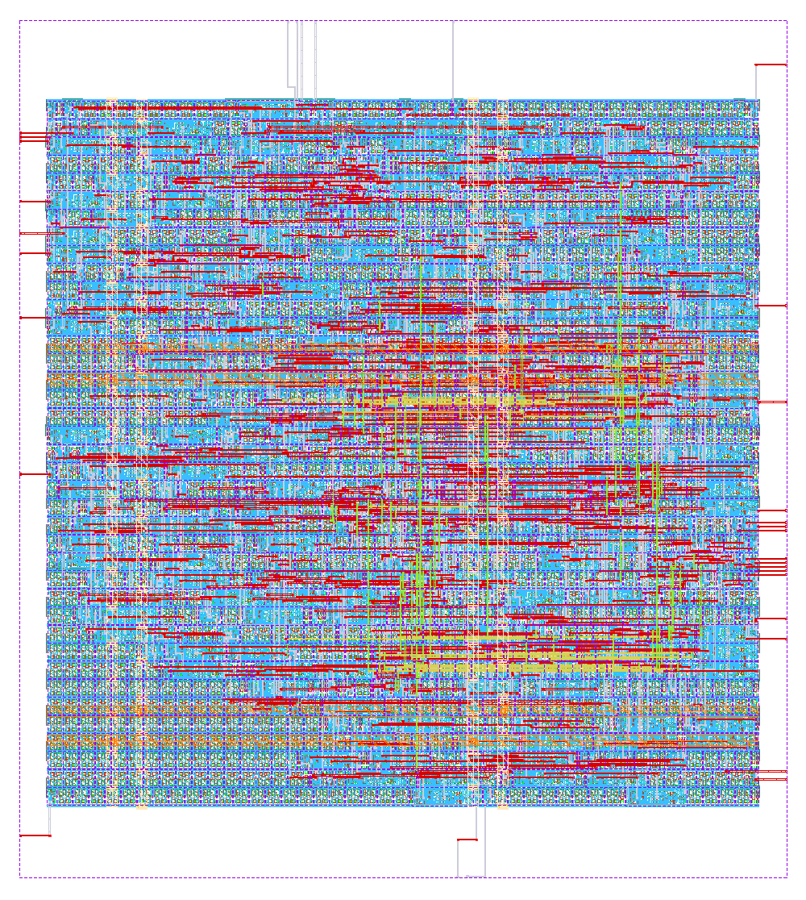

# spi_slave (all-modes) — SPI Slave IP for IHP SG13G2

A variant of [spi-slave-ihp](..) that supports **all four SPI
modes** (mode 0–3), selected by two configuration pins `CPOL` / `CPHA`.
Designed to interface common SPI masters such as the **Raspberry Pi**
(spidev, modes 0–3) and the **Infineon AURIX** microcontroller (QSPI
module, modes 0–3).

**Author:** Koen Van Caekenberghe, ChipDesign B.V.
**License:** Apache 2.0
**PDK:** IHP SG13G2

---

## Design overview

The `spi_slave` module exposes eight 8-bit registers over SPI and provides a
secondary parallel read port for on-chip register readback independent of the
SPI bus.

| Feature | Value |
|---|---|
| Protocol | SPI modes 0–3, selected by `CPOL`/`CPHA` input pins |
| Register count | 8 × 8-bit |
| Address bits | 7 (lower bits of command byte) |
| R/nW flag | Bit 7 of command byte: 1=Read, 0=Write |
| Parallel read port | `Add2_in[7:0]` / `Data2_out[7:0]` |
| Debug port | `debug[7:0]` — sticky OR of FSM states visited |
| Reset | Active-low asynchronous (`iRST_N`) |
| Max SCK | ≤ Clk/8 (SCK is oversampled by the system clock) |

### Differences vs. the mode-0-only variant

* New input pins `CPOL` and `CPHA` select the SPI mode:

  | Mode | CPOL | CPHA | SCK idle | Master/slave sample on | Slave drives MISO on |
  |---|---|---|---|---|---|
  | 0 | 0 | 0 | low  | rising (leading) | falling (trailing) |
  | 1 | 0 | 1 | low  | falling (trailing) | rising (leading) |
  | 2 | 1 | 0 | high | falling (leading) | rising (trailing) |
  | 3 | 1 | 1 | high | rising (trailing) | falling (leading) |

* Internally, the synchronised SCK is XOR-ed with `CPOL` so the FSM always
  sees mode-0 polarity; `CPHA` then chooses whether the sample edge is the
  leading or trailing edge. The FSM itself (IDLE → COMMAND → READ/WRITE →
  END) is unchanged from the original.
* `CPOL`/`CPHA` pass through the same two-flip-flop synchroniser as the SPI
  signals and are latched only while the FSM is in IDLE, so a transaction
  always runs with a consistent mode pair. **The mode pins must be stable
  before `SSEL` is asserted.** They may be strap resistors (fixed mode) or
  two host GPIOs (mode switchable at runtime between transactions).

---

## Interfacing a Raspberry Pi

The Raspberry Pi's hardware SPI master (BCM283x/BCM2711/BCM2712, 3.3 V CMOS
— directly compatible with SG13G2 3.3 V I/O) supports all four modes.

Wiring (40-pin header, SPI0):

| Pi pin | Signal | spi_slave port |
|---|---|---|
| 19 (GPIO10) | MOSI | `MOSI` |
| 21 (GPIO9)  | MISO | `MISO` |
| 23 (GPIO11) | SCLK | `SCK` |
| 24 (GPIO8)  | CE0  | `SSEL` |
| any 2 GPIOs (or straps) | mode select | `CPOL`, `CPHA` |

Example with python3-spidev (mode 3 shown; set `CPOL`/`CPHA` pins to match
`spi.mode` before the first transfer):

```python
import spidev
spi = spidev.SpiDev()
spi.open(0, 0)                 # bus 0, CE0
spi.mode = 3                   # 0, 1, 2 or 3 — must match CPOL/CPHA pins
spi.max_speed_hz = 10_000_000  # keep SCK <= Clk/8

rx = spi.xfer2([0x81, 0x00])   # READ  register 1 -> rx[1]
spi.xfer2([0x03, 0x55])        # WRITE 0x55 -> register 3
```

`xfer2` keeps CE0 asserted for the whole two-byte transaction and deasserts
it afterwards, which is exactly what the FSM's END state expects.

---

## Interfacing an Infineon AURIX microcontroller

The AURIX (TC2xx/TC3xx) QSPI module is a full-featured SPI master with
per-channel clock polarity and phase, so any of the four modes works. Use a
3.3 V-supplied port pad group; a 5 V-tolerant configuration requires level
shifting toward the 3.3 V SG13G2 I/O.

Wiring: QSPIx `MTSR` → `MOSI`, QSPIx `MRST` ← `MISO`, QSPIx `SCLK` → `SCK`,
one `SLSO[n]` chip-select → `SSEL` (active low), two port pins (or straps)
→ `CPOL`/`CPHA`.

With the Infineon iLLD, the mode is set in the SPI channel configuration:

```c
IfxQspi_SpiMaster_ChannelConfig chCfg;
IfxQspi_SpiMaster_initChannelConfig(&chCfg, &qspiMaster);
/* SPI mode 3 = idle high, sample on trailing (rising) edge: */
chCfg.base.mode.clockPolarity = SpiIf_ClockPolarity_idleHigh;              /* CPOL=1 */
chCfg.base.mode.shiftClock    = SpiIf_ShiftClock_shiftTransmitDataOnLeadingEdge; /* CPHA=1 */
chCfg.base.baudrate           = 10000000;  /* keep SCLK <= Clk/8 */
```

(`SpiIf_ClockPolarity_idleLow` + `...shiftTransmitDataOnTrailingEdge`
gives mode 0.) Configure the `SLSO` so it stays asserted across the
command + data byte pair — e.g. send both bytes in one exchange buffer.

---

## Repository layout

```
spi_slave.v                  RTL source (all-modes variant)
tb_spi_slave.v               Self-checking testbench — READ/WRITE/READ in all 4 modes;
                             compile with -DSYNTH to run it on the synthesised netlist
tb_spi_slave_rpi.v           Host testbench — Raspberry Pi (spidev/BCM SPI) master model
tb_spi_slave_aurix.v         Host testbench — AURIX QSPI master model, full register sweep
gen_waveforms.py             VCD parser, B2B comparison and waveform PNG generator
waveform_rtl.png             RTL simulation waveform (modes 0–3)
waveform_b2b.png             B2B overlay waveform (RTL vs netlist, modes 0–3)
spi_slave.gds                Final GDS (IHP SG13G2 core macro, DRC/LVS clean, no seal ring)
spi_slave.def                Final DEF
layout_render.png            Final routed layout render
flow/
  config.yaml                LibreLane flow configuration
  constraint.sdc             Timing constraints (10 ns system clock)
  run_flow.sh                Flow entry point
  ihp_pdk.env.example        PDK environment template
  Makefile                   LibreLane/OpenROAD make targets
  spi_slave_synth.v          Yosys-generated structural netlist
  spi_slave_synth.json       Synthesis netlist (JSON)
  synth.ys                   Yosys synthesis script (standalone)
  place_route.tcl            OpenROAD fallback placement script
```

---

## RTL simulation

Requires [Icarus Verilog](https://steveicarus.github.io/iverilog/) ≥ 11.

```bash
# RTL
iverilog -g2012 -o tb_rtl.out tb_spi_slave.v
vvp tb_rtl.out                    # produces tb_spi_slave.vcd

# Synthesised netlist (Yosys generic cells, no PDK library needed)
cd flow && yosys synth.ys && cd ..
iverilog -g2012 -DSYNTH -o tb_syn.out flow/spi_slave_synth.v tb_spi_slave.v
vvp tb_syn.out                    # produces tb_spi_slave_synth.vcd
```

Both runs print:

```
MODE 0 (CPOL=0 CPHA=0) 1120: miso_rx1=0x0b data=0xa0 miso_rx3=0xa0 debug=0x1f
MODE 1 (CPOL=0 CPHA=1) 2240: miso_rx1=0x0b data=0xa1 miso_rx3=0xa1 debug=0x1f
MODE 2 (CPOL=1 CPHA=0) 3360: miso_rx1=0x0b data=0xa2 miso_rx3=0xa2 debug=0x1f
MODE 3 (CPOL=1 CPHA=1) 4480: miso_rx1=0x0b data=0xa3 miso_rx3=0xa3 debug=0x1f
PASS: all checks passed in all 4 SPI modes
```

Per mode the testbench resets the DUT, then runs: Tx1 READ Register1
(expects reset value 0x0B), Tx2 WRITE (0xA0|mode) → Register3, Tx3 READ
Register3 back, and finally checks `debug == 0x1F` (all five FSM states
visited).

### Generate waveform images and B2B comparison

```bash
pip install matplotlib numpy          # one-time
python3 gen_waveforms.py              # reads *.vcd, writes waveform_*.png
```

---

## Verification results

All checks pass in every SPI mode, on the RTL and bit-for-bit identically on
the Yosys-synthesised netlist:

| Check | Mode 0 | Mode 1 | Mode 2 | Mode 3 |
|---|---|---|---|---|
| Tx1 READ Reg1 = 0x0B | ✓ | ✓ | ✓ | ✓ |
| Tx2 WRITE committed (parallel port) | 0xA0 ✓ | 0xA1 ✓ | 0xA2 ✓ | 0xA3 ✓ |
| Tx3 READ-back = written value | ✓ | ✓ | ✓ | ✓ |
| debug = 0x1F (all FSM states) | ✓ | ✓ | ✓ | ✓ |

### Host-level verification (Raspberry Pi and AURIX master models)

Two additional testbenches model the two target hosts and run against both
the RTL and the synthesised netlist (`-DSYNTH`), each in all four modes with
a DUT reset between modes:

* **`tb_spi_slave_rpi.v`** — Raspberry Pi master model: 100 MHz DUT clock,
  10 MHz SCK, spidev `xfer2`-style transfers (CE0 held low across the
  2-byte buffer, bytes back-to-back, ~1 SCK period CS setup). Checks
  register read, write + read-back, the parallel port, an out-of-range
  address read (expects 0xFF), and `debug == 0x1F`.

  ```
  PASS: Raspberry Pi master model — all checks passed in all 4 SPI modes
  ```

* **`tb_spi_slave_aurix.v`** — AURIX QSPI master model: 100 MHz DUT clock,
  12.5 MHz SCLK (the SCK ≤ Clk/8 limit), SLSO lead/trail delays and
  inter-word idle of one SCLK period each (SLSO kept asserted across the
  frame). Performs a full register-map sweep per mode: writes a distinct
  value to all 8 registers, reads all 8 back over SPI, reads all 8 through
  the parallel port, then checks the out-of-range read and `debug`.

  ```
  PASS: AURIX QSPI master model — all checks passed in all 4 SPI modes
  ```

```bash
iverilog -g2012 -o tb_rpi_rtl.out   tb_spi_slave_rpi.v   && vvp tb_rpi_rtl.out
iverilog -g2012 -o tb_aurix_rtl.out tb_spi_slave_aurix.v && vvp tb_aurix_rtl.out
# and the same with -DSYNTH + flow/spi_slave_synth.v for the netlist
```





---

## RTL-to-GDS flow

Same LibreLane/OpenROAD flow as the original variant. The top module is
still named `spi_slave`; the only netlist-level difference is the two
additional input pins `CPOL` and `CPHA`.

```bash
cd flow
cp ihp_pdk.env.example ihp_pdk.env
# Edit ihp_pdk.env — set PDK_ROOT and PATH to match your installation
./run_flow.sh
```

> **Note (LibreLane v3):** the seal-ring patch documented for the original
> variant is obsolete — LibreLane ≥ 3 drives the seal ring through a
> PDK-provided `KLAYOUT_SEALRING_SCRIPT`. What *is* required is that the
> `klayout` binary is on the PATH of the login shell the Makefile spawns:
> `ihp_pdk.env` here adds `/foss/tools/klayout` for that reason. A failed
> run can be resumed with
> `librelane config.yaml --pdk $PDK --pdk-root $PDK_ROOT --manual-pdk --last-run --from <Step>`.

### Flow results (LibreLane v3.1.0, Classic flow, 70 steps)

| Metric | Value |
|---|---|
| Run | `flow/runs/RUN_2026-08-08_21-52-37` |
| Die size | 160.61 µm × 179.33 µm |
| Final GDS | `spi_slave.gds` (core macro, no seal ring — see signoff section) |
| Std-cell utilization | 53.5 % |
| Setup WNS / TNS | 0 / 0 (all corners: ss 1.08 V 125 °C, tt 1.20 V 25 °C, ff 1.32 V −40 °C) |
| Hold WNS / TNS | 0 / 0 (all corners) |
| Routing DRC errors | 0 (after 3 detailed-routing iterations) |
| Antenna violations | 0 nets / 0 pins |
| LVS (Netgen) | Pass — 0 errors, 0 unmatched devices/nets/pins |
| Max slew / max cap violations | 0 |
| Max fanout violations | 1 (one buffer drives 9 loads, limit 8 — no timing impact, slack unaffected) |
| Total power (tt, 1.2 V, 25 °C) | ≈ 1.08 mW |
| Chip DRC | Skipped (KLayout and Magic DRC disabled in config, as in the original variant) |



### Signoff DRC and LVS (standalone, IHP KLayout deck + Netgen)

Signoff was run with the IHP SG13G2 KLayout rule deck
(`$PDK_ROOT/ihp-sg13g2/libs.tech/klayout/tech/drc/run_drc.py`, full deck,
deep mode) and Netgen LVS (LibreLane `Netgen.LVS` step). Identical
invocations were used for this variant and for the original
[spi-slave-ihp](..) as a control.

| Check | Original spi-slave-ihp | This variant |
|---|---|---|
| Netgen LVS | Match uniquely (597 devices / 608 nets) | Match uniquely (617 devices / 630 nets) |
| KLayout DRC, core macro | 8 markers, all chip-level density/fill | 8 markers, all chip-level density/fill |
| KLayout DRC, seal-ringed GDS | 21,208 markers | 15,177 markers |

The 8 core-macro markers (`M1.j`–`M5.j`, `TM1.c`, `TM2.c`, `AFil.g`/`GFil.g`)
are single-marker chip-level metal-density and filler checks that fire on any
unfilled macro — IHP's own standard cells produce the identical set through
the same harness. They are resolved by foundry density fill at tapeout, not
layout defects.

**Known LibreLane v3 defect — do not use the seal-ringed GDS.** The
`KLayout.SealRing` step inserts a ring that is (a) sized `die − 64.4 µm` and
inset 32.2 µm, so it physically overlaps the routed core (≈1.7 kµm² of
Activ/pSD/Metal1/Cont overlap in this variant, ≈2.3 kµm² in the original's
shipped GDS), and (b) carries an `EdgeSeal` (39/4) marker drawn as a
full-die box instead of the ring annulus, which makes the DRC deck classify
the entire chip as seal-ring structures (the `Seal.*` marker cascade). Both
effects are flow artifacts present identically in both designs. The
deliverable `spi_slave.gds` here is therefore the DRC/LVS-clean pre-seal-ring
KLayout stream-out; a seal ring must be added correctly at chip assembly.

---

## Thick-oxide (3.3 V) build

This variant is also implemented on the thick-oxide `sg13g2_stdcell_hv`
library, in [`flow_hv/`](flow_hv/). The library is expected as a sibling
checkout of the repository root's parent; `flow_hv/config.yaml` resolves it
relatively.

```bash
cd flow_hv
cp ihp_pdk.env.example ihp_pdk.env
./run_flow.sh
./verify_gl.sh      # gate-level simulation, all four SPI modes
```

| Metric | 1.2 V (thin oxide) | 3.3 V (thick oxide) |
|---|---|---|
| Die size | 160.61 × 179.33 µm | 354.0 × 399.6 µm |
| Std-cell area | 11 737 µm² | 41 630 µm² |
| Clock | 10 ns (100 MHz) | 10 ns (100 MHz) |
| Setup / hold WNS | 0 / 0, three corners | 0 / 0, typical corner only |
| Routing DRC / antenna / LVS | 0 / 0 / clean | 0 / 0 / clean |
| Signoff DRC (IHP KLayout deck) | clean (density markers only) | clean (density markers only) |
| Gate-level simulation | pass, 4 modes | pass, 4 modes |

The signoff GDS and its DRC run are in [`signoff_hv/`](signoff_hv/); the
root README's thick-oxide section explains the two flow-level exclusions
(antenna-diode heuristic, decap fillers) and the library-level rail-tap
contact fix that the clean signoff depends on.

Same clock, so the SPI-side limit is unchanged: f_SCK ≤ f_Clk/8 = 12.5 MHz,
and the Raspberry Pi and AURIX wiring above applies to the 3.3 V build as
well — with the advantage that the thick-oxide I/O is native 3.3 V, so no
level shifting is needed toward either host.

The thick-oxide flow needs a non-standard flip-flop mapping, a longer
excluded-cell list and Metal1 routing; the repository root README explains
why, and `flow_hv/config.yaml` documents each setting at the point of use.

---

## License

Copyright 2026 Koen Van Caekenberghe, ChipDesign B.V.

Licensed under the [Apache License, Version 2.0](../LICENSE).
